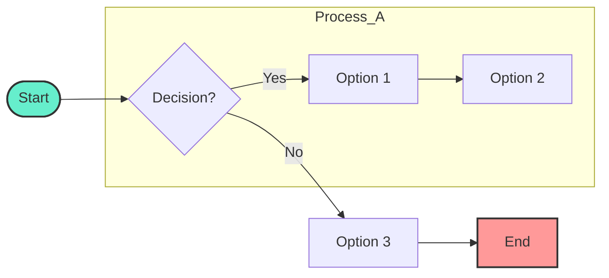

# Testing the footer update.

```mermaid
flowchart LR
    Start(["Start"]) --> Decision{"Decision?"}
    
    subgraph Process_A
        Decision -->|Yes| Option1["Option 1"]
        Option1 --> Option2["Option 2"]
    end

    Decision -->|No| Option3["Option 3"]
    Option3 --> End["End"]

    style Start fill:#6ec,stroke:#333,stroke-width:2px
    style End fill:#f99,stroke:#333,stroke-width:2px
```
